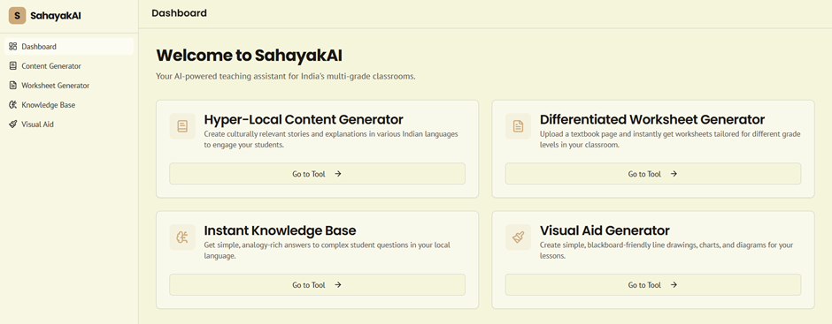
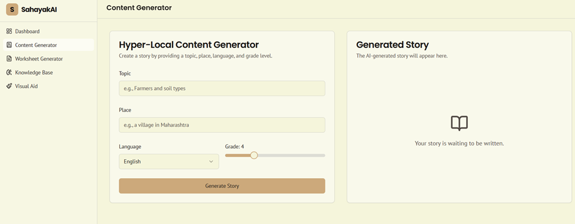
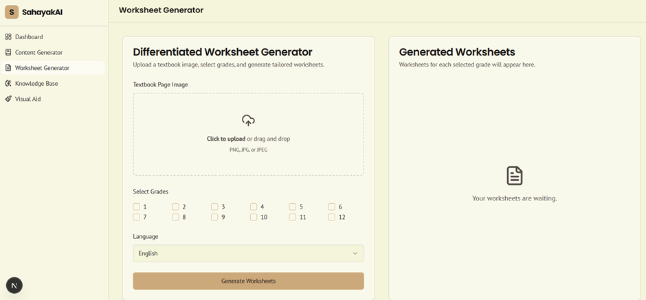
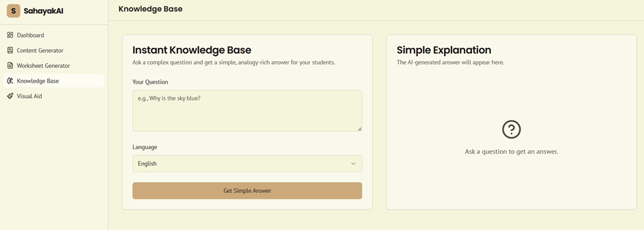
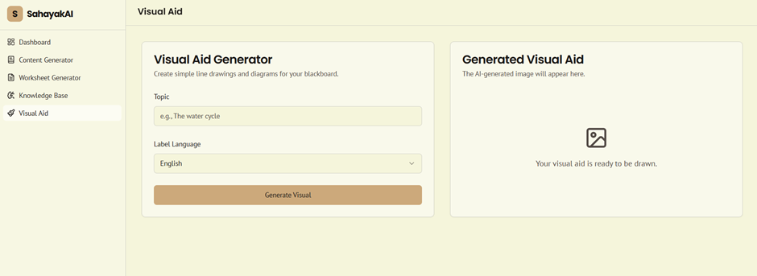
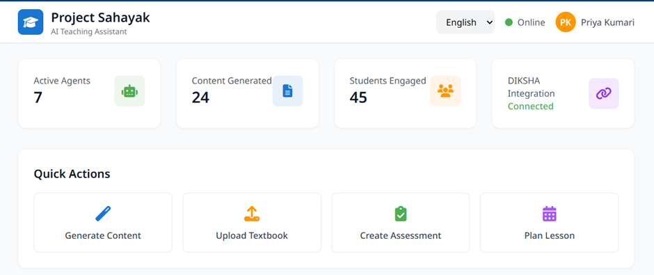
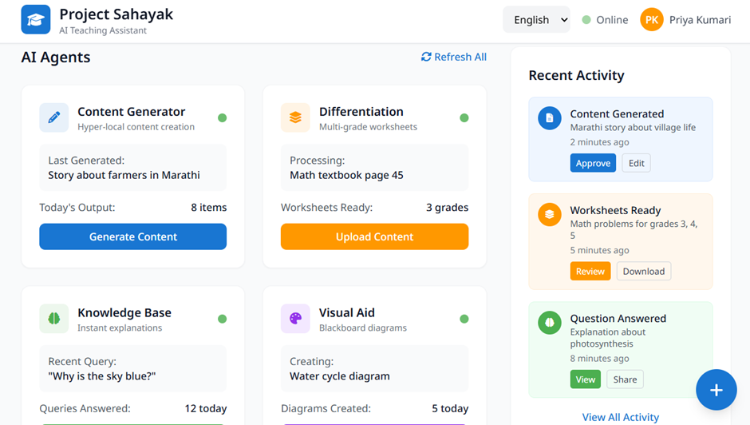
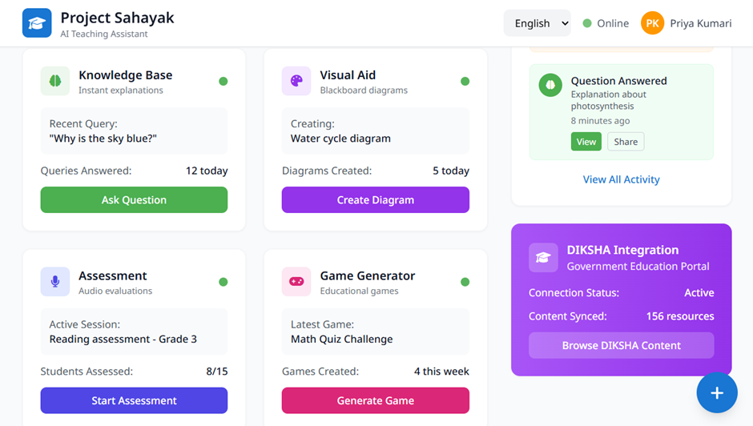
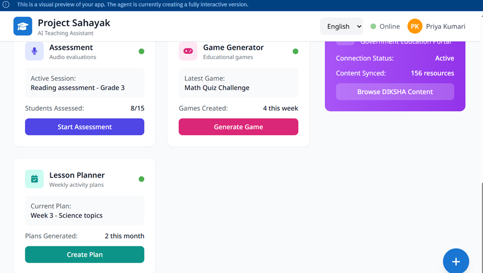

# Team AgentInn  
*A humble request… Let our Agents enter Inn :) *

## Project Sahayak: An Agentic AI Platform for India’s Multi-Grade Classrooms

---

## Overview

Project Sahayak directly addresses the complex challenges faced by under-resourced, multi-grade classrooms in India by providing an AI-driven solution that is both pragmatic and scalable. Developed within the demanding constraints of limited connectivity and a rapid prototyping schedule, our team engineered a robust, production-ready prototype on Firebase, ensuring seamless live deployment capabilities essential for rural environments. Integrating Google’s advanced agentic AI suite—Gemini, Vertex AI, AI Studio, Model Garden, and Imagen 3—with ElevenLabs’ voice synthesis technology, Sahayak delivers an adaptive, multimodal teaching assistant tailored for immediate classroom relevance and teacher empowerment.

A cornerstone of our innovation is the planned and demonstrated integration with the DIKSHA portal, enabling direct access to extensive, government-curated curricular resources from within the application. This feature is evidenced in our detailed prototype workflows and screenshots, and positions Sahayak as a catalyst for scalable educational transformation. The solution prioritizes teacher governance, cultural appropriateness, and rapid ease of use, supporting diverse learner needs. All key architectural layers have been documented on the GitHub page and showcased to highlight immediate classroom impact and a sustainable roadmap for nationwide adoption.

---

## Pedagogical Context and Vision

India’s education system, particularly in rural and under-resourced regions, faces significant challenges that have been well-documented by both research studies and government reports. 
- According to a 2021 National Sample Survey (NSS), more than 60% of India’s primary schools are single-teacher schools, with over 900,000 such institutions across the country.
- This is compounded by a teacher shortage in rural areas, where less than 50% of teachers receive any form of specialized training to handle multi-grade classrooms, as highlighted in Ministry of Education reports.
- A 2020 report from UNESCO Institute for Statistics reveals India has one of the highest student-to-teacher ratios, especially in multi-grade settings, making it challenging to provide individual attention.

Despite government efforts (Samagra Shiksha Abhiyan, DIKSHA platform), which have improved access and curriculum support for over 250 million learners in multiple languages, a critical gap in personalized learning support remains—especially for children with diverse learning needs.

The National Education Policy (NEP) 2020 advocates leveraging technology and AI to create inclusive, equitable, and high-quality education. Project Sahayak aims to become the “second teacher” in classrooms, supplying hyper-local content, adaptive worksheets, rapid visual aids, and voice-based assessments while ensuring the human teacher remains central. Google’s flagship Gemini models, now multimodal, long-context, and available in nine Indian languages, are at the core of this vision.

---

## Current Working Prototype

Project Sahayak is fully operational as a live, production-ready prototype. Teachers and stakeholders can explore the following features in the working system:

- **AI-driven content generation**: Hyper-local stories, adaptive worksheets using Gemini models.
- **Offline-first delivery**: Built on Firebase for robust access in low or no-connectivity settings.
- **Teacher dashboard**: Simple, accessible PWA interface with support for classroom workflows.

### Live Application

- **[Access the Sahayak Firebase Application](https://9000-firebase-studio-1753567570501.cluster-44kx2eiocbhe2tyk3zoyo3ryuo.cloudworkstations.dev)**

### Demo Videos

- **[Demo Video Collection (Pastebin link)](https://pastebin.com/QWxAdjED)**

### Key Screenshots

### Current Working Prototype:

> 

> 

> 

> 

> 

### Planned Prototype:

> 

> 

> 

> 

---

## High-Level Architecture

The Sahayak platform is structured using a modular, scalable architecture that leverages the best of Google Cloud, open educational APIs, and offline-first delivery to support robust classroom deployments across India.

| **Layer**          | **Google Service(s)**                 | **Role in Sahayak**                           | **Key Agent APIs**                |
|--------------------|---------------------------------------|-----------------------------------------------|-----------------------------------|
| Presentation (Web/PWA) | Firebase Hosting                   | Offline-first React/Flutter dashboard         | Firestore SDK, Cloud Storage SDK  |
| Orchestration      | Cloud Functions + Pub/Sub             | Event routing, agent scheduling               | google-genai, Vertex AI SDK       |
| Core Models        | Gemini 2.5 Pro/Flash on Vertex AI     | Local-language generation, multimodal reasoning| generateContent, countTokens      |
| Specialized Models | Imagen 3, Chirp STT, Gemma fine-tunes | Line drawings, speech analysis, on-device NLU | generateImage, transcribe         |
| Knowledge Base     | DIKSHA Open APIs, NCERT PDF corpus    | Curricular facts, textbook data, QR metadata  | /api/content/v1/search            |
| Data               | Firestore, Cloud Storage              | Prompt caching, student attempts, analytics   | Security Rules v3                 |

> *Note: Gemini APIs can be accessed via the Developer endpoint or toggled with `vertexai: true` in the unified Google Gen AI SDK.*

---

## Multi-Agent System Design

Sahayak's multi-agent design allows modular, loosely-coupled workflows where each AI agent specializes in core classroom tasks. Results are published to Firestore and downstream functions are triggered for composed classroom workflows.

| **Agent**            | **Purpose**                                 | **Inputs**                  | **Outputs**         | **Sample Model**      |
|----------------------|---------------------------------------------|-----------------------------|---------------------|-----------------------|
| Content Agent        | Generate hyper-local stories, explanations  | Language code, topic        | Markdown/HTML story | gemini-2.5-pro        |
| Differentiation Agent| Grade-specific worksheets from textbook images | Image/PDF, grade dist.    | PDF/HTML worksheets | gemini-2.5-pro-vision |
| Knowledge Agent      | Answer “Why?” questions with analogies      | Natural language query      | 3-level analogy     | gemini-2.5-flash      |
| Visual Aid Agent     | Draw chalkboard diagrams                    | Prompt text                 | 1024×1024 PNG       | imagen-3-light        |
| Assessment Agent     | Assess oral reading                         | Audio blob                  | Fluency score/feedback | Chirp STT + gemini-2.5-pro |
| Game Agent           | Create classroom learning games             | Topic, device type          | JSON game spec      | gemini-2.5-flash      |
| Planner Agent        | Generate weekly lesson plans                | Curriculum map, analytics   | CSV lesson matrix   | gemini-2.5-pro        |

> *All agents are orchestrated via Firestore triggers and Cloud Functions, enabling loose coupling, error handling, and reliable retries during scaled operation.*

---

*Continue with your next section, such as DIKSHA Integration, Key Features, or Getting Started...*

---

## DIKSHA Integration Strategies

Seamless integration with the DIKSHA platform is at the core of Sahayak’s contextual curriculum support and personalized learning. The system enables teachers to instantly retrieve government-curated resources using simple QR scans, driving classroom relevance and rapid agentic workflows.

### 1. QR-Code Lookup: Automated Contextual Content Retrieval

**Workflow Overview**
- **Scan Event:**  
  The teacher scans a DIKSHA QR code from a textbook using the Sahayak PWA (Progressive Web App).
- **Trigger Cloud Function:**  
  The PWA sends the scanned QR string (conforming to DIKSHA’s schema) to a Google Cloud Function endpoint.
- **Fetch Resource:**  
  The Cloud Function builds a DIKSHA API request, fetches relevant open resources, and returns results to the app.
- **Inject as Agent Context:**  
  The orchestration layer uses this content as direct context for downstream AI agents (e.g., Content and Differentiation Agents).

---

**Reference Implementation**

#### Sahayak PWA JavaScript Snippet (Triggering the Cloud Function)

// Web front end snippet, assumes result of QR scan is 'qrString'
fetch('https://sahayak-cloudfunc-url/qrlookup', {
    method: 'POST',
    headers: {'Content-Type': 'application/json'},
    body: JSON.stringify({ identifier: qrString })
})
.then(r => r.json())
.then(data => {
    // Show or pass content to AI agents, e.g., ContentAgent.consume(data)
});

#### Google Cloud Function (Python 3):

import requests
from flask import Request, jsonify

ENDPOINT = "https://diksha.gov.in/api/content/v1/search"

def qrlookup(request: Request):
    data = request.get_json(silent=True)
    qr_id = data["identifier"]
    lang = data.get("language", "en")  # fallback
    params = {"identifier": qr_id, "language": lang, "limit": 10}
    resp = requests.get(ENDPOINT, params=params, timeout=8)
    resources = resp.json().get("result", {}).get("content", [])
    # Process: filter, reformat, attach attributions, etc.
    return jsonify({"resources": resources})

**Key Notes**
- Handle Errors: Add robust error/timeout handling and input validation.
- Security: Use Firebase Auth to authorize PWA requests if necessary.
- Privacy: Only fetch and store minimal necessary data.

---

#### 2. Content API Bridge: Direct Programmatic API Pull

A core building block—fetch any chapter/module/unit, mapped by DIKSHA identifiers.

**Reusable Python Utility:**

import requests

ENDPOINT = "https://diksha.gov.in/api/content/v1/search"

def fetch_diksha(unit_id: str, language="mr", limit=50):
    params = {"identifier": unit_id, "language": language, "limit": limit}
    r = requests.get(ENDPOINT, params=params, timeout=10)
    r.raise_for_status()
    return r.json()

#### Example Usage:

resources = fetch_diksha("do_12345678", language="hi")["result"]["content"]
for item in resources:
    print(item["name"], item.get("downloadUrl"))

- Plug into Cloud Functions or Batch Pipelines
- Cache results in Firestore to reduce API load and improve UI responsiveness.

---

#### 3. Licensing Check: Attribution Enforcement & Compliance

**DIKSHA License:**
All content is CC-BY-NC-SA (Creative Commons, Attribution-NonCommercial-ShareAlike).

**How Sahayak Ensures Compliance:**
**Citation Injection:**
- Every time agent outputs DIKSHA-derived or derivative content, inject attribution metadata.
**Prompt Engineering:**
- When using agents to generate derivative works, dynamically append the source and original license to the prompt and output.

#### Example Attribution Injection (Python):

def inject_attribution(base_prompt: str, source_title: str, source_url: str):
    attribution = (
        f"Content is based on: {source_title} from DIKSHA ({source_url}). "
        "DIKSHA resources are licensed under CC-BY-NC-SA."
    )
    return f"{base_prompt}\n\n{attribution}"

**Auditing:**
Periodically audit output content and logs to ensure compliance.

**UI Compliance:**
Display 'Powered by DIKSHA' and CC-BY-NC-SA badges on the Sahayak app or in agent outputs. DIKSHA materials are CC-BY-NC-SA (meaning, that anyone can copy, redistribute, remix, adapt, and build upon the material for non-commercial purposes, as long as they give appropriate credit to the original creator and license their new creations under the same or a compatible license); generated derivatives must preserve attribution. The Orchestrator injects source citations into prompts to ensure compliance. 

#### 4. Shared Utilities: Translation & Token Estimation

#### a. Zero-shot Translation + Language Detection

#### Language Detection (with langdetect):

from langdetect import detect

def detect_lang(text):
    return detect(text)  # returns ISO 639-1 code, e.g., 'hi', 'bn'

Gemini-powered Fast Translation:

from google import genai
import os

genai.configure(api_key=os.getenv("GEMINI_API_KEY"))
cli = genai.Client()

def smart_translate(text: str, target_language: str) -> str:
    resp = cli.models.generate_content(
        model="gemini-2.5-flash",
        contents=f"Translate this to {target_language}: {text}"
    )
    return resp.text

#### b. Token Cost Estimation
#### Token Helper:

def estimate_tokens(text: str) -> int:
    return cli.count_tokens(text)["totalTokens"]

- Use this before agent API calls to predict costs, handle quotas, and batch large payloads efficiently.

#### c. Modularization Example
- We can bundle all shared utilities in sahayak_utils.py:
def agent_context_with_translation(text, dest_lang):
    detected = detect_lang(text)
    if detected != dest_lang:
        text = smart_translate(text, dest_lang)
    return text

#### End-to-End Orchestration Example
A scanned QR triggers a fetch, agent pipeline, and citation-compliant output:

Teacher → [Scan QR] → Sahayak PWA → [Cloud Function query DIKSHA]
    → [Resources + Attribution → Content Agent] → [Localized, compliant output]

---

#### Agent Implementation Walk-Through

#### A. Hyper-Local Content Agent – Content Generator

**Purpose: Generate culturally appropriate, local-language stories for a classroom context.**

from google import genai

client = genai.Client()
SYSTEM_PROMPT = """
You are Sahayak Content Agent. Produce culturally relevant stories for grade {grade}.
Write in {lang} using simple sentences. Keep each paragraph <=3 lines.
"""

def make_story(topic, place, lang="mr", grade=4):
    ctx = SYSTEM_PROMPT.format(lang=lang, grade=grade)
    user = f"Create a 250-word story set in {place} about {topic}."
    resp = client.models.generate_content(
        model="gemini-2.5-pro",
        contents=[
            {"role": "system", "parts": [ctx]},
            {"role": "user", "parts": [user]},
        ],
        config={"temperature": 0.7}
    )
    return resp.text

- Gemini 2.5 Pro provides balanced latency and factuality for text-only calls. Adjust model to "gemini-2.5-flash" for faster, slightly less detailed output

#### B. Differentiation Agent (Multimodal) – Differentiation

**Purpose: Generate grade-specific worksheets or exercises from scans or textbook images.**

from google import genai

client = genai.Client(vertexai=True, project="sahayak-prj", location="asia-south1")
def differentiate(img_uri, grades=[1,3,5], lang="hi"):
    prompt = [
        {"mimeType": "image/jpeg", "uri": img_uri},
        {"text": f"Extract the key concept. For each grade {grades}, create 5 questions of increasing complexity in {lang}. Return JSON."}
    ]
    resp = client.models.generate_content("gemini-2.5-pro-vision", contents=prompt)
    return resp.text

- Passing a Cloud Storage URI lets Vertex AI handle byte streaming automatically. Accepts Cloud Storage URIs or base64-encoded images for input

#### C. Knowledge Agent (Quick Answers) – Knowledge Base

**Purpose: Answer “Why?” or “How?” queries for students in their local language, as analogies.**

def kid_answer(question, lang="bn"):
    seed = f"Explain to a 10-year-old in {lang}. Use a relatable analogy."
    resp = client.models.generate_content(
        "gemini-2.5-flash",
        contents=[seed, question],
        config={"temperature": 0.3}
    )
    return resp.text

- Flash models answer within sub-second latency, ideal for in-class Q&A. 

#### D. Visual Aid Agent (Imagen 3) – Visual Aid

**Purpose: Create simple, chalkboard-style diagrams on demand in local script.**

from google import genai
from PIL import Image
from io import BytesIO

client = genai.Client()
def draw_diagram(topic, lang="kn"):
    prompt = f"simple chalkboard style line drawing of {topic}, labels in {lang}"
    response = client.models.generate_images(
        model="imagen-3.0-generate-002",   # Imagen 3-light or newer
        prompt=prompt,
        config={"number_of_images": 1}
    )
    for generated_image in response.generated_images:
        image = Image.open(BytesIO(generated_image.image.image_bytes))
        image.show()
        # Or save via image.save("diagram.png")

- Imagen 3-Light produces crisp diagrams with low inference cost. Imagen 3 supports 1024x1024 PNG output and can be integrated via Vertex AI

#### E. Audio Assessment Agent – Assessment

**Purpose: Assess oral reading using the Chirp STT model plus Gemini for feedback.**

1.	Web client records 20-second oral reading.
2.	Upload to gs://sahayak-audio/{student}.wav.
3.	Cloud Function:

import os
from google.api_core.client_options import ClientOptions
from google.cloud.speech_v2 import SpeechClient
from google.cloud.speech_v2.types import cloud_speech
from google import genai

PROJECT_ID = os.getenv("GOOGLE_CLOUD_PROJECT")
def transcribe_and_score(audio_file):
    # Transcribe with Chirp
    client = SpeechClient(client_options=ClientOptions(api_endpoint="us-central1-speech.googleapis.com"))
    with open(audio_file, "rb") as f:
        audio_content = f.read()
    config = cloud_speech.RecognitionConfig(
        auto_decoding_config=cloud_speech.AutoDetectDecodingConfig(),
        language_codes=["en-IN"],
        model="chirp",
    )
    request = cloud_speech.RecognizeRequest(
        recognizer=f"projects/{PROJECT_ID}/locations/us-central1/recognizers/_",
        config=config,
        content=audio_content,
    )
    response = client.recognize(request=request)
    transcript = response.results[0].alternatives[0].transcript

    # Feed transcript to Gemini for assessment
    genai_client = genai.Client()
    feedback = genai_client.models.generate_content(
        "gemini-2.5-pro",
        contents=f"Student read: {transcript}\nEvaluate fluency, mispronunciations, WPM."
    )
    return feedback.text

#### F. Game Generator 

**Purpose: Auto-generate classroom games (specs as JSON or Phaser/Flutter code) for quick engagement.**

from google import genai

client = genai.Client()
def generate_game(topic, device_type="web"):
    prompt = (
        f"Create a simple educational game for '{topic}' suitable for {device_type}. "
        "Return the game spec in JSON (Phaser for web, Flutter for mobile)."
    )
    response = client.models.generate_content(
        "gemini-2.5-flash",
        contents=prompt,
        config={"temperature": 0.6}
    )
    return response.text

- Example prompt: “Make me a captivating endless runner game. Key instructions on the screen. p5js scene, no HTML.”

#### G. Lesson Planner

**Purpose: Weekly lesson plan generator, aligned to state curricula and ability groups.**

from google import genai

client = genai.Client()
def plan_lessons(subject, grade, curriculum_map, past_data=None, lang="en"):
    system_instr = (
        f"You are a lesson planning assistant for Indian primary school {subject}, grade {grade}. "
        "Using the curriculum map provided, create a week-by-week lesson schedule. Format output as CSV. "
        f"Respond in {lang}."
    )
    prompt = [
        {"role": "system", "parts": [system_instr]},
        {"role": "user", "parts": [f"Curriculum outline:\n{curriculum_map}\nLearning analytics:\n{past_data}"]}
    ]
    # Remove past_data if not available
    resp = client.models.generate_content(
        "gemini-2.5-pro",
        contents=prompt,
        config={"temperature": 0.4}
    )
    return resp.text

- You can use detailed role/system prompts for differentiation, accommodations, and structure

#### Orchestration Blueprint
- graph TD
- A[Firestore Trigger] --> FN(Cloud Function)
- FN -->|Prompt| Gemini
- FN -->|Image prompt| Imagen3
- FN -->|Store| GCS
- Gemini -->|JSON| Firestore
- Teacher -->|Approve| PWA

- Cloud Functions are configured with minimum instances = 0 to stay within free tier during pilots; cold-start latencies are mitigated by pre-warming via scheduler pings.

#### Offline-First Delivery

Firebase’s bundleWithFirestore generates static rule-prefetched snapshots, ensuring worksheet and story assets load offline; once connectivity returns, a background sync pushes analytics back to Firestore.

# Firebase Studio

This is a NextJS starter in Firebase Studio.

To get started, take a look at src/app/page.tsx.

---

## Responsible AI & Safety Controls

Sahayak is engineered with a strong commitment to responsible AI, data privacy, and ethical deployment. The following controls and strategies ensure safe, fair, and reliable usage in sensitive educational settings.

| **Risk**           | **Mitigation**                                      | **Google Capability**           |
|--------------------|-----------------------------------------------------|---------------------------------|
| Hallucination      | Retrieval Augmented Generation (RAG) using DIKSHA sources, “cite sources” prompt | Grounding tool                  |
| Offensive output   | Blocklists plus strict safety level (BLOCK_MEDIUM_AND_ABOVE)                   | Gemini Safety Config            |
| Data privacy       | Per-school Firestore namespace, Firebase Auth, minimal data storage            | IAM + VPC-SC                    |
| Bias               | Multilingual evaluation sets, human-in-the-loop review                          | Vertex AI Eval Hub              |

- RAG and citation-prompts ground all instructional content in trusted sources.
- Offensive/unsafe outputs are proactively blocked by configuration and review.
- User and school identity is siloed via namespaced Firestore, secured by Firebase Auth and network controls.
- Bias and fairness are evaluated using government-aligned datasets and native-language testing with Vertex AI evaluation tooling.

---

## Cost Projection (100 Teachers, 1 Month Pilot)

Sahayak is designed to be highly cost-effective for pilots and scalable deployments. The following table summarizes expected monthly costs for a 100-teacher pilot:

| **Item**             | **Unit**       | **Qty** | **Cost (USD)** | **Cost (₹)** |
|----------------------|----------------|---------|----------------|--------------|
| Gemini Pro tokens    | 1 M tokens     | 20      | $60            | ₹5,190       |
| Vision calls         | 0.01 per image | 2,000   | $20            | ₹1,730       |
| Imagen 3 light       | 0.02 per image | 1,000   | $20            | ₹1,730       |
| Chirp STT            | 0.006 per min  | 500 min | $3             | ₹260         |
| Cloud Functions      | 2 M invocations| 1       | $0 (free tier) | ₹0           |
| Firestore + Storage  | —              | —       | $10            | ₹865         |
| **Total**            |                |         | **$113**       | **₹9,975**   |

- Cloud Functions run within the free tier for this pilot size.
- Cost structure is transparent and supports straightforward scaling for larger rollouts.

---

---

## MVP Validation Checklist

The following real-world scenarios demonstrate the immediate classroom impact and robustness of Project Sahayak’s prototype:

- **Content Agent:** Teacher can create a Marathi soil-type story within 10 seconds.
- **Differentiation Agent:** Uploading a Class IV EVS textbook page produces three worksheets for grades II, IV, and V automatically.
- **Knowledge Agent:** Voice query "आकाश निळं का असतं?" (“Why is the sky blue?”) returns a child-friendly analogy in under 2 seconds.
- **Visual Aid Agent:** Blackboard diagram auto-downloads as a PNG image under 200KB.
- **Assessment Agent:** Reading fluency dashboard automatically updates WPM bar chart upon oral assessment.

---

## Future Extensions

Sahayak is built with extensibility at its core. Upcoming features and enhancements on the roadmap include:

- **On-Device Gemini Nano:** Enables Sahayak’s AI features in completely offline schools via Android APK sideloading.
- **DIKSHA Upload Bot:** Automatically converts teacher-approved assets to SCORM packages for direct DIKSHA upload, closing the feedback loop for open educational resources.
- **Edge-TPU Caching:** Accelerates Gemma fine-tune models for rapid, local language translation during power outages or severe connectivity disruption.

---

## Conclusion

Project Sahayak operationalizes state-of-the-art agentic AI, combining multilingual Gemini reasoning, DIKSHA’s open curriculum, and robust Google Cloud infrastructure. Teachers gain the ability to generate contextually resonant, multimodal materials in seconds—enabling them to focus on authentic student engagement and learning.

Sahayak is modular and scalable:
- Instantly deployable as a single Firebase project,
- National scale enabled by expanding Vertex AI quotas,
- Fully aligned with the Ministry of Education’s open platform mission.

Sahayak is setting a pragmatic, sustainable path to equitable, AI-powered education in India’s diverse classroom landscape.

---

## Acknowledgements

- Firstly, We would like to thank and praise the Almighty God for everything. 

- Special thanks to the Google Cloud team for empowering us with technical resources, mentorship, and the opportunity to bring Project Sahayak to life. 

We also acknowledge the Ministry of Education and the DIKSHA platform for pioneering open educational access in India, as well as ElevenLabs for enabling transformative voice features. 

- Our heartfelt appreciation goes to all mentors, reviewers, and the wider hackathon community whose support, encouragement, and feedback have shaped every stage of our work. Thank you for making this mission possible!

---

*Thank you for reviewing Project Sahayak! For demo access, feedback, or collaboration, please reach out to our team via the Hack2skill portal.*

Thanks & Regards,
Team AgentInn.
